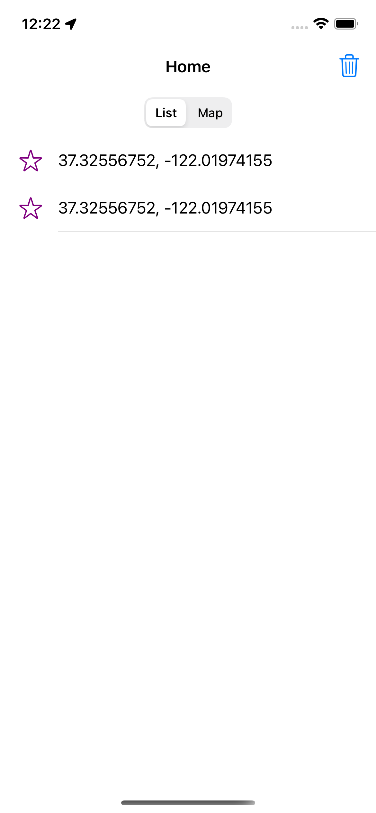
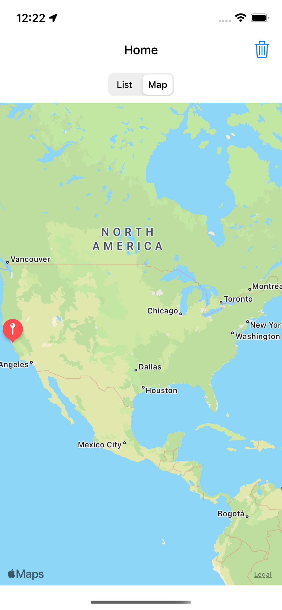

# TrackingLocation

## Requirement

```
Build a demo app with requirements :

- Using MVVM structure 

 - Using background service for tracking user location in foreground, background , killer app mode and saved it into local

 - Display all local location saved into Map View

 - Display all local location saved into List View
```

## Implementation

### Setup UI




### Setup pods

```
pod init
```

Add the following lines to the pod file

```
  use_frameworks!

  # Pods for TrackingLocation
  pod 'RxCocoa'
  pod 'RxSwift'
  pod 'RxGesture'
  pod 'Swinject'
```
then **Run** in terminal

```
pod install
```

### Setup MVVM

- Define input protocol

```
protocol HomeViewModelInputs {
    var viewDidLoad: PublishRelay<Void> { get }
    var didBecomeActive: PublishRelay<Void> { get }
    var segmentValueChanged: PublishRelay<Int> { get }
    var clearData: PublishRelay<Void> { get }
}
```

- Define output protocol

```
protocol HomeViewModelOutputs {
    func numberOfRows() -> Int
    func getLocation(at indexPath: IndexPath) -> Location
    var reloadTableView: PublishRelay<Void> { get }
    var showMap: PublishRelay<Void> { get }
    var showList: PublishRelay<Void> { get }
    var segmentTitles: PublishRelay<[String]> { get }
    var showTitle: PublishRelay<String> { get }
    var points: PublishRelay<[CLLocationCoordinate2D]> { get }
}
```

- Create class DefaultHomeViewModel and implement protocol input and output
- Handle binding between controller and view model. We will handle in

```
func bind() { 
//...
}
```

### Get current location by Core Location

We need custom LocationManager for manage request, get location, ... easier.

```
final class LocationManager: NSObject {
//...
func request() {}
func getCurrentLocation() -> CLLocation? {}
//...
}
```

**P/s: We need call request before get current location.**

### Tracking and save data to local

- We will use UserDefault for store it.

Create class Session, it will be do that inside.

```
class Session {
    
    var locationsSaved: [Location] {
        get {
            if let data = UserDefaults.standard.data(forKey: "locationsSaved") {
                let decoder = JSONDecoder()
                let locations = try? decoder.decode([Location].self, from: data)
                return locations ?? []
            }
            return []
        } set {
            let encoder = JSONEncoder()
            let data = try? encoder.encode(newValue)
            UserDefaults.standard.set(data, forKey: "locationsSaved")
        }
    }
    
    static let shared = Session()
    
    private init() { }
}
```

- Tracking in **SceneDelegate.swift**

sceneDidDisconnect, sceneWillResignActive, sceneDidEnterBackground